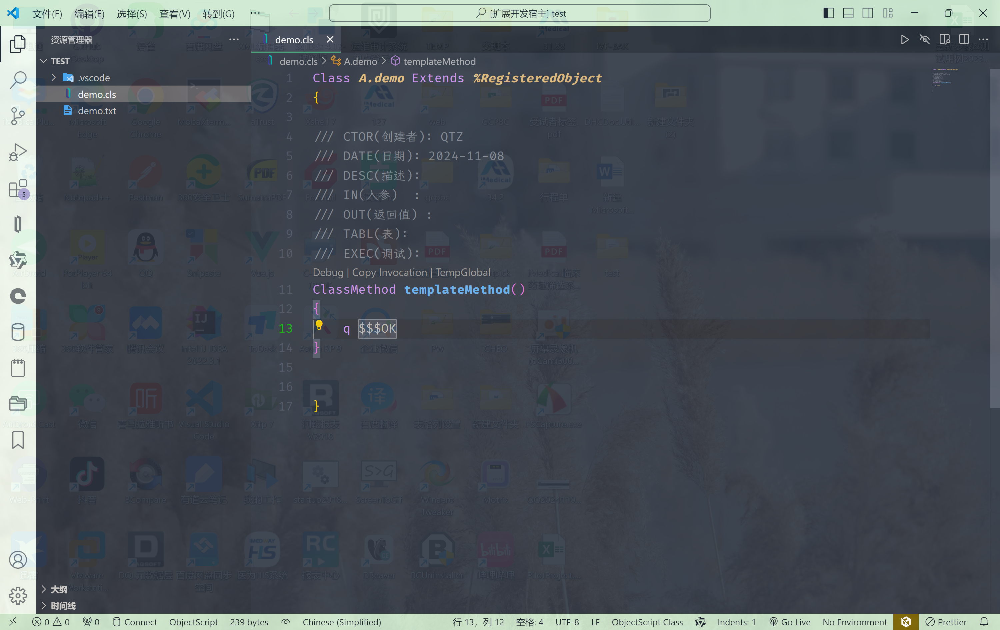

# Qtz HIS AI

欢迎来到 `Qtz HIS AI`

> TempGlobal设置

## 安装

This extension for Visual Studio Code adds themes titled `Qtz HIS AI`.

1. Open **Extensions** sidebar panel in Visual Studio Code. `View → Extensions`
2. Search for `Qtz HIS AI`
3. Click **Install**
4. Click **Reload**

## 预览

END！
